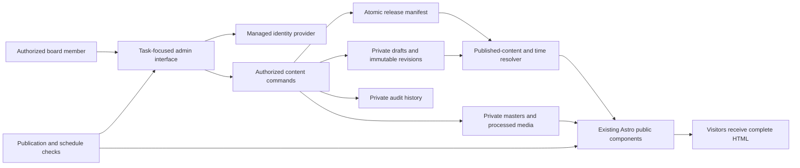

# MSA at UIC Website Admin Panel

**Document type:** Product, interaction, and implementation requirements  
**Status:** Proposed specification; the admin panel is not implemented  
**Prepared:** September 12, 2026  
**Repository:** `nauraiz0/msawebsite2026`  
**Destination:** `website-improvements/adminpanel.md`  
**Audience:** MSA board, website designer, and implementing developer

## 1. Product brief

Build an invite-only website administration area where an authorized MSA board member can update Friday prayer details, daily prayer information, announcements, and ordinary page content using clear forms. The main workflow is **choose what to update → edit → preview → publish → verify the live result**. Board members should not need GitHub accounts, terminal commands, source-code access, or knowledge of the hosting provider to perform these tasks.

The panel should feel like a small, dependable workspace for running the MSA website. Its first screen should answer: **What prayer information is live? What needs attention? What can I update now?** Prioritize those answers over traffic charts, decorative dashboard widgets, or a large collection of settings.

Preserve the public website's existing Astro components, campus identity, useful fallback messages, and external membership/payment workflows. Introduce structured content and a secure publishing service so that a content edit no longer requires changing an Astro or TypeScript file. This specification extends the first-release brief, which intentionally deferred an admin dashboard; it does not describe an existing capability.

### Reading guide

- Sections 2–5: codebase findings, scope, roles, and information architecture.
- Sections 6–13: detailed screen, form, workflow, and visual requirements.
- Sections 14–18: publishing, data contracts, security, and integration design.
- Sections 19–22: acceptance criteria, delivery sequence, ownership, and decisions.

**Requirement language:** MUST is a release requirement. SHOULD is a recommended default that may change with a documented reason. MAY is optional. P0 is the first usable release; P1 is the next increment; P2 is deferred. Requirements below are proposed product decisions unless explicitly labeled as observed codebase behavior.

## 2. Codebase baseline and implications

### 2.1 Review basis

The redesign branch is `codex/msa-website-redesign`, reviewed at commit `598bbf69d35933e83ef3f43f16c2831aeb90d15a`. The repository's `main` branch was reviewed at `25a6e7a8415c6566f5a1d076f6e45442a3864d74`. The comparison showed that `main` contains the same website implementation plus `website-improvements/revision-one-feedback.md`.

The source review covered the public page templates, shared components, data modules, styles, interactions, build/deployment scripts, maintenance instructions, and content/site/state tests. Forty-nine local source/configuration/test files were compared with GitHub blob hashes after line-ending normalization; all matched the reviewed `main` snapshot. The remote tree contained no `AGENTS.md`. This is a source review, not a claim that a production website or hosting account was inspected.

Primary repository references:

- [Reviewed implementation](https://github.com/nauraiz0/msawebsite2026/tree/25a6e7a8415c6566f5a1d076f6e45442a3864d74)
- [Original website brief](../improvements.md)
- [Maintenance and annual handover](../docs/maintenance.md)
- [Revision one feedback](revision-one-feedback.md)
- [Existing implementation notes](../docs/implementation-plan.md)

### 2.2 What exists today

| Area | Observed source | Current behavior | Admin-panel consequence |
| --- | --- | --- | --- |
| Framework | `package.json`, `astro.config.mjs` | Astro `^7.3.2`, TypeScript `^5.9.3`, static output; no server adapter configured | Authentication, durable editing, and request-time content require new infrastructure; an `/admin` page alone is insufficient. |
| Toolchain | `package.json`, `.github/workflows/site.yml` | pnpm `11.19.0`; workflow uses Node 24; package engine permits `>=22.12.0` | Preserve the working toolchain and lockfile during migration. |
| Site settings | `src/data/site.ts` | Contact, membership, group access, social links, navigation, prayer, giving, and involvement share one executable module | Split editable content into validated records; keep layout and application logic outside the editor. |
| Friday prayer | `src/data/site.ts` | Session labels/times, source date, nullable weekly room, directions, and one message-only exception | Add dated weekly records, explicit confirmation, session-level changes, and reliable expiry. |
| Current supplied prayer data | `src/data/site.ts` | 1:05 PM and 3:05 PM; source received September 11, 2026; weekly location unknown | These are imported supplied times, not evidence that a future Friday or room is confirmed. |
| Daily prayer | `src/data/site.ts` | `verified: false`; location, hours, and directions are null | Preserve an honest unconfirmed state; never invent a campus room or derive congregational times from an API. |
| Prayer rendering | `PrayerSummary.astro`, `prayer.astro` | Both read the same prayer object, but each evaluates exceptions separately at build time | Replace duplicated selection logic with one effective-prayer resolver used by all displays and previews. |
| Prayer poster | `src/pages/prayer.astro` | Fixed asset paths and hard-coded 1:05/3:05 text in image alt text/dialog metadata | An update must also reconcile or remove the old poster and its text alternatives. |
| Notices | `announcements.json`, `activeNotices()`, `index.astro` | Empty array; model has title, summary, URL, start, expiry, owner; homepage renders summary links for all active notices | Add an editor, durable IDs, ordering, controlled placements, and publication state. |
| Events | `events.json`, `src/lib/events.ts` | Empty array with typed event model; current/past/cancelled/postponed handling; no recurrence generator | Build on the existing event model instead of introducing a second event source. |
| Event routes | `src/pages/events/[slug].astro` | Detail routes generated by `getStaticPaths()` | A newly published event cannot gain a working detail route on the current static deployment without a rebuild. |
| Ramadan | `src/pages/ramadan.astro` | Current/future Ramadan-category events activate the program view, including cancellations | Keep derived program state synchronized with event edits; do not maintain duplicate iftar lists. |
| Page copy | `src/pages/*.astro` | Most headings, descriptions, FAQs, CTAs, and section text are embedded in templates | Extract explicitly editable fields before claiming that page editing is supported. |
| Resources | `src/data/resources.ts`, `ResourceDetail.astro` | Five resource pages with sections, links, source URLs, and review dates; lectures have special rendering | Preserve source/review metadata and support both text resources and recording links. |
| Images | `photos.ts`, `Photo.astro`, `optimize-images.mjs` | Named assets, responsive variants, dimensions, focal points, alt text, captions; optimizer uses a fixed input list | Uploading a file must also create a complete asset record and usable variants. |
| Shared content | Header, footer, resource components | Some links use `site` data; some email/brand text remains literal; social links are sometimes accessed by array index | Migrate all consumers, use stable social IDs, and prevent seemingly global edits from changing only one occurrence. |
| Freshness | `.github/workflows/site.yml` | Scheduled build at 07:17 UTC daily; time comparisons are evaluated during rendering/build | Current daily builds cannot guarantee minute-level notices, prayer changes, or expiry. |
| Deployment | `scripts/trigger-deploy.mjs` | Missing hook exits successfully; an accepted hook confirms a request, not a live deployment | “Build succeeded” and “hook accepted” must never be shown as “Live.” |
| Hosting | `docs/maintenance.md` | Production host is documented as not configured; Cloudflare Pages is one suggested option | Select and verify the actual runtime/host before implementing the publishing contract. |
| Public discovery | `scripts/postbuild.mjs` | Sitemap scans built HTML; robots allows crawling | Exclude admin/drafts and replace static route scanning where content routes become dynamic. |
| Existing tests | `tests/*.mjs` | Date/time, content, generated HTML, accessibility, layouts, and synthetic states; several assertions contain exact original content | Keep behavior checks, but move mutable-content assertions to controlled fixtures. |

### 2.3 Existing feedback to accommodate

`revision-one-feedback.md` requests board profiles, more MSA photography, an events calendar, and easier discovery of nested resources. The admin design SHOULD support those additions through reusable records. Board profiles and a public calendar grid are P1; the first release must not wait for those public features. Resource editing must expose Books directly in the page list. Editing content does not automatically fix the public navigation feedback; that remains a separate implementation task.

## 3. Outcomes, scope, and release priorities

### 3.1 Measurable outcomes

After a short orientation, a board member SHOULD be able to:

| Task | Usability target, starting from the dashboard | Completion evidence |
| --- | --- | --- |
| Change this Friday's room and directions | Within 90 seconds, excluding authentication | Both prayer displays show the same confirmed change. |
| Cancel one Friday session | Within 60 seconds | Cancelled session is clearly labeled; other sessions remain accurate. |
| Post a short announcement | Within 2 minutes | Correct copy, destination, placement, start, and expiry appear in preview and live output. |
| Update an existing page paragraph or link | Within 3 minutes | Selected section changes while layout and other sections remain intact. |
| Replace a page photo | Within 3 minutes after upload completes | Mobile/desktop crops, alt text, and credit are preserved or intentionally updated. |
| Restore a mistaken edit | Within 2 minutes | Selected content is restored without undoing unrelated edits. |

Targets are acceptance goals to measure with representative board members, not claims about current performance. Ordinary publication SHOULD become observable within 60 seconds in healthy operation; the exact semantics and outage handling are in Section 14.

### 3.2 P0 — first usable release

1. Invite-only access, explicit publishing permissions, and account revocation.
2. Dashboard with current prayer status, quick actions, drafts, and publishing problems.
3. Jummah editor: baseline schedule, dated Friday details, rooms/directions, multiple sessions, temporary changes, cancellations, and poster reconciliation.
4. Daily prayer-space editor and optional manually confirmed congregation times.
5. Announcements: create, edit, preview, publish, schedule, expire, and archive.
6. Structured editing of existing pages, resource pages, shared contact/community links, FAQs, and approved images.
7. Basic editing of existing event records: create/update, cancel/postpone, RSVP link, image, and preview.
8. Draft saving, independent live version, publication checks, revision history, restoration, and concurrent-edit protection.
9. A working secure content service and public delivery integration satisfying freshness and fallback requirements.
10. A documented board handover and recovery process.

### 3.3 P1 and P2

| Priority | Additions |
| --- | --- |
| P1 | Board roster/term editor and public Meet the Board page; richer event calendar; bounded event recurrence; more granular committee permissions; optional review queue; bulk media selection; internal reminders. |
| P2 | Multiple-language authoring; calendar subscriptions; broader analytics; additional approved page templates; advanced content reuse/reporting. |

### 3.4 Explicit boundaries

The first release is not a drag-and-drop website builder. Do not expose arbitrary HTML, JavaScript, CSS, template files, route creation, or theme customization. Preserve CampusGroups membership and group-access workflows, YouTube recordings, and existing external donation processing. Do not create a membership database, collect banking details, or send WhatsApp/social/email announcements automatically.

Donation recipients, payment URLs, recipient artwork, domain/DNS, and hosting secrets remain outside ordinary page editing. They require a separate authorized maintenance workflow. A board member may update approved non-payment copy on the Donate page; that permission must not let them introduce a replacement payment link through a generic CTA field.

## 4. Users, permissions, and ownership

### 4.1 Roles

Use three visible role names. A publisher may also be designated as a content owner, such as the Prayer Lead; ownership identifies responsibility and does not create a hidden authorization rule.

| Capability | Contributor | Publisher | Administrator |
| --- | --- | --- | --- |
| View live content and authorized history | Yes | Yes | Yes |
| Create/edit drafts and upload ordinary media | Yes | Yes | Yes |
| Preview own/assigned drafts | Yes | Yes | Yes |
| Publish/schedule/withdraw ordinary content | No | Yes | Yes |
| Confirm prayer logistics or cancel sessions | Draft only | Yes | Yes |
| Restore an earlier ordinary-content revision | Draft only | Yes | Yes |
| Change shared contact and membership/group links | Draft only | No | Yes |
| Invite/revoke accounts and change roles | No | No | Yes |
| View private access/security records | No | No | Yes |
| Edit payment recipients or infrastructure in this panel | No | No | No in P0 |

P0 publishing is direct for Publishers. Do not force routine Friday changes through a second person's approval. Contributors see **Save draft** and **Ready for publisher**, with an in-panel queue; external notifications are optional future work. Default new invitations to Contributor. Assign Publisher explicitly to board members responsible for operational updates.

### 4.2 Ownership requirements

- Maintain at least two organization-designated Administrators; block removal/demotion of the last active Administrator.
- Every operational item must have a responsible owner, but public output must not expose that person's login email or private account ID.
- Record who actually verified prayer information separately from who saved or published it.
- A departing board member's drafts remain recoverable after ownership is reassigned. Revoking their account must revoke current sessions and prevent future scheduled writes under their authority.
- Already-live content remains live after a departure. Future scheduled releases authored/published by a revoked Publisher pause for an active Publisher to adopt; time-based expiry of existing public content continues.
- Public board-profile records are separate from admin accounts. Adding someone's biography must not give them login access, and removing a profile must not be the account-revocation mechanism.

## 5. Information architecture

### 5.1 Navigation and routes

Use a dedicated admin layout without the public site's marketing header/footer. Recommended same-origin routes are below; an equivalent isolated admin origin is acceptable if preview/security behavior remains intact.

| Navigation label | Route | Primary contents |
| --- | --- | --- |
| Overview | `/admin/` | Quick actions, Friday status, items needing attention, recent publications |
| Prayer & Jummah | `/admin/prayer/` | This Friday, future Fridays, baseline schedule, daily space, congregation times, temporary updates |
| Announcements | `/admin/announcements/` | Live, scheduled, draft, expired/archived notices |
| Pages | `/admin/pages/` | Named existing pages, section editors, shared-content references |
| Events | `/admin/events/` | Upcoming, ongoing, cancelled/postponed, past, drafts |
| Media | `/admin/media/` | Images/posters, search, usage, replacement/crop tools |
| History | `/admin/history/` | Publications and field-level content changes |
| Settings | `/admin/settings/` | Organization links, user access, content owners, operational health |

Resources appear inside Pages with direct child entries, including **Books** and **Lectures & recordings**. P1 adds **Board** under Pages or as a dedicated navigation entry if usage warrants it. Avoid adding nested navigation beyond two levels.

### 5.2 Naming and discovery

- Use **Jummah** in the admin navigation for familiar typing; retain the public website's current **Jumu’ah** display spelling. Search must match `jummah`, `jumma`, `jumuah`, `jumu’ah`, and `Friday prayer`.
- Identify pages by public name and path, not filenames: **About MSA — /about/**.
- Provide **View website** and contextual **View live page** links. A draft preview must be explicitly labeled as a preview.
- Admin search searches authorized content titles, page names, and section labels; it must not expose private notes from inaccessible areas.
- Keep location/status/date visible in list rows; use text labels alongside any colored badge.

## 6. Visual design and screen composition

### 6.1 Visual direction

Use the public site's cream, navy, white, and restrained gold palette. The panel should be quieter and denser than the public homepage, with clear task hierarchy and generous form spacing. Avoid large hero photography in the admin workspace.

| Token | Default | Use |
| --- | --- | --- |
| Page background | `#F7F4ED` | Workspace background; matches existing `--paper` |
| Panel background | `#FFFFFF` | Forms, tables, confirmation sheets |
| Primary text | `#18243B` | Headings and body text |
| Primary action | `#21365A` | Publish and primary navigation states |
| Action hover | `#172842` | Primary button hover |
| Soft highlight | `#E7ECF3` | Selected items, preview controls, informational callouts |
| Secondary text | `#536075` | Helper text and metadata |
| Border | `#D9DDE3` | Panel separation; strengthen interactive-control borders if needed for contrast |
| Accent | `#B78B46` | Small decorative accents; do not assume it is suitable for small text |
| Error | `#A32D32` | Error text/icon with accessible supporting surface |
| Success / warning | Proposed `#246747` / `#805500` | Status text; verify final foreground/background pairs |

Use DM Sans for forms, navigation, tables, and headings. Libre Baskerville MAY appear in a small identity element or public preview, but not as the standard form font. Use 16px input/body text, 14px helper text, 24–32px screen titles, and a 1.5 body line height. Reuse the 10px control and 16px panel radii. Use a 4/8px spacing scale with 16–24px between field groups.

### 6.2 Responsive shell

- At 1100px and wider: approximately 232px sidebar, 64px top bar, and content area with a 1280px maximum width. Main editor and preview may sit side by side.
- From 768–1099px: collapsed/drawer navigation; editor and preview become tabs or stacked regions. Never squeeze the form into a narrow desktop column.
- Below 768px: one-column layout, 16px side padding, 56–64px top bar, and a persistent bottom action area with safe-area padding. No icon-only bottom navigation competing with editor actions.
- At 320px: every task must remain possible without page-wide horizontal scrolling. Convert dense table rows to labeled cards. Diff tables may use a clearly bounded scroll region only when a stacked alternative is also available.
- Controls and primary hit areas SHOULD be at least 44×44 CSS pixels. Mobile actions must remain reachable when the keyboard is open, without covering the focused field or errors.
- Preview widths: Phone 390px, Tablet 768px, Desktop 1440px. Include a 320px QA size during verification even if it is not a primary preview preset.

### 6.3 Overview screen

Recommended desktop composition:

```text
┌──────────────────┬─────────────────────────────────────────────────────┐
│ MSA Website      │ Overview                          View website  You │
│                  ├─────────────────────────────────────────────────────┤
│ Overview         │ Keep the community up to date                       │
│ Prayer & Jummah  │ [Update this Friday] [Post announcement] [Edit page]│
│ Announcements    │                                                     │
│ Pages            │ This Friday, [full date]       Publishing status    │
│ Events           │ Confirmed / Needs confirmation Live / Needs check │
│ Media            │ Sessions • location • source   Last verified time │
│ History          │ [Review prayer information]                         │
│ Settings         │                                                     │
│                  │ Needs attention                                     │
│                  │ • Weekly location is not confirmed                  │
│                  │ • A poster no longer matches the schedule           │
│                  │ • A publication could not be verified               │
│                  │                                                     │
│                  │ Drafts and upcoming changes     Recent publications │
└──────────────────┴─────────────────────────────────────────────────────┘
```

Do not display example warnings when no matching condition exists. In a clean state, show **Everything is up to date** with the last successful check time. Do not use “all systems operational” unless actual health checks support it.

Dashboard requirements:

1. Put **Update this Friday** first, followed by **Post announcement** and **Edit a page**.
2. Show the actual campus-local Friday date. Saturday through Thursday selects the next Friday; Friday selects today until local midnight.
3. Show baseline-only, confirmed, changed, cancelled, and expired/unconfirmed states distinctly.
4. Link each attention item directly to the record and field that needs work.
5. Prioritize unverified urgent publications, current prayer conflicts, and missing weekly confirmation above routine review reminders.
6. Show scheduled changes with local date/time and affected page. Separate schedules from unfinished drafts.
7. Show the last five publication actions with actor display name, content name, and outcome. Full history remains in History.
8. Do not make visitor analytics a P0 dashboard requirement.

### 6.4 Shared editor layout

```text
← Prayer & Jummah        Friday, [full date]               Live + draft
Draft saved [time]       Chicago time                     View live

[Details] [Preview] [History]

What is changing?
[This Friday only ▼]

Session 1                                Public preview
Time [__:__] [AM/PM]                      Phone | Desktop
Room [________________]                  [Actual site component]
Directions [_______________________]

Verification
Confirmed by [person]   Confirmed at [date/time]
Source/reference [_____________________________________]

Appears on: Home → Prayer summary; Prayer → Friday details

[Save draft]                         [Preview changes] [Publish changes]
```

The field order must follow how a board member thinks about the task: date/scope, what visitors need to know, optional supporting information, then verification and publication. Technical logs, IDs, and integration details belong in expandable support areas.

## 7. Common editing interactions

### 7.1 Drafts and saving

- Opening an existing item shows its live revision. Editing creates/updates a separate draft; it does not mutate public content.
- Autosave SHOULD begin after approximately 1.5 seconds of inactivity and after field blur. Provide explicit **Save draft** as well. Incomplete but structurally safe drafts may save; publication requires all mandatory content checks.
- Show **Saving…**, **Draft saved at [time]**, **Changes not saved**, or **Offline — changes remain in this tab**. “Saved” means the server acknowledged durable storage.
- Keep unsent form values in memory while the tab stays open. Do not claim cross-device recovery for unsaved data. Refresh/close warnings must appear while changes are only local.
- After sign-in expiry, preserve the form in the current tab while offering reauthentication; resume saving only after access is rechecked.
- Saving a draft must not update public verification dates or mark old prayer facts as newly confirmed.
- A dirty tab must not overwrite a more recent server draft automatically. Use version checking and the conflict behavior in Section 14.

### 7.2 Fields and validation

- Place permanent labels above inputs; placeholders are examples, not labels.
- Display optional/required status consistently. Use specific examples such as **Building and room** and **How to find the entrance**.
- Show character counts near limits. Preserve pasted text, normalize ordinary whitespace, and show validation errors without deleting content.
- Validate inline after interaction and again on publication. Focus an error summary linking to affected fields when publication fails validation.
- Distinguish **Cannot publish** errors from **Please check** warnings. Invalid links, missing required times, conflicting prayer overrides, and unconfirmed claimed locations block publication. Long-but-valid copy and missing optional images produce warnings.
- Validate URLs by field purpose. Normal public links allow `https://`; internal links use a known site route with optional valid fragment; contact fields may generate `mailto:` or `tel:`. Reject scripts, `data:`, protocol-relative links, and arbitrary embed code.
- Internal destination selection must include title/path search and validate fragments. A missing destination blocks publication unless the same release creates it.
- Dates use a calendar plus an editable text fallback. Times use a clear 12-hour input with AM/PM and a read-only **America/Chicago** context. Store unambiguous instants on the server.

### 7.3 Review and preview

- Preview must render the same components, field transformations, selection rules, and rich-text sanitizer as the public site.
- Let users preview **Now** or the scheduled effective time. Label simulated future time visibly; never confuse it with what is currently live.
- Show the draft beside the current live result or offer a toggle. Provide a plain-language difference list, such as **First prayer: room changed** and **Announcement expires Friday at 6:00 PM**.
- Display all affected public locations before publishing. Shared content must reveal its broader impact.
- Previews are authenticated, `noindex`, and non-cacheable. The P0 preview link requires an authorized session; possession of a URL alone is insufficient.
- Previewed external links may open in a new tab for checking. Preview must not execute payments, registrations, or messaging actions on behalf of the user.

### 7.4 Confirmation and destructive actions

- Ordinary publication uses one concise review sheet showing changed fields, affected pages, effective time, and any acknowledged warnings. Its final action is **Publish changes** or **Schedule changes**.
- Do not require a second person to approve routine publication by an authorized Publisher.
- Use **Archive**, **Cancel session**, **Withdraw announcement**, and **Restore revision** instead of a vague trash icon.
- Archiving is reversible. Permanent content deletion is unavailable in P0. Media deletion is addressed separately in Section 13.
- Confirm cancellations and withdrawals with the exact event/session/date and resulting visitor message. Do not use a generic “Are you sure?” dialog.
- Success remains visible in the editor with **View live page**; a short-lived toast must not be the only record of the outcome.

## 8. Prayer & Jummah requirements

### 8.1 Screen organization

Provide four tabs: **This Friday**, **Future Fridays**, **Daily prayer**, and **Regular schedule**. Temporary changes are contextual actions inside the first three tabs, not an unrelated announcement form. The opening tab summarizes what visitors currently see and offers **Update details**, **Change a session**, and **Cancel a session**.

Use three distinct record types:

1. **Regular schedule:** board-approved recurring session times for an explicit term/date range. It does not confirm a particular weekly room.
2. **Friday details:** facts confirmed for one local Friday date; may inherit selected baseline times but must explicitly confirm each published location.
3. **Temporary update:** a bounded structured override of specific Friday sessions or daily-space availability, optionally paired with a public explanation.

Separate the concept of *content publication* from the prayer service's *operating status*. A published record can truthfully say that a session is cancelled or its room is unconfirmed.

### 8.2 Regular schedule fields

| Field | Input and validation | Public behavior |
| --- | --- | --- |
| Internal schedule name | Required, 1–80 characters | Admin only; e.g., a board-supplied term name |
| Effective first/last dates | Required local dates; end on/after start; overlapping active baselines prohibited | Baseline is eligible only within this range |
| Sessions | 1–4 by default; ordered by local start time; stable session IDs | Render supplied session labels and times |
| Session label | Required, 1–40 characters | E.g., First prayer; do not infer what “start” means |
| Start time and meaning | Required time; label whether khutbah begins or prayer begins | Public label must match what the board actually confirmed |
| Optional end time | After start on same Friday; unknown permitted | Display only when confirmed and useful |
| Default location mode | `announced_weekly` or `fixed_confirmed` | Default to announced weekly on import |
| Fixed default location | Required only in fixed-confirmed mode; source and validity required | May recur only when the board explicitly confirms the booking period |
| Source received date | Required when importing/supplying a schedule | Labeled “Schedule supplied”; not “Verified this week” |
| Confirmed by / at | Required for newly confirmed baseline; authenticated actor recorded separately | Public may show a confirmation date, not a private identity |
| Source/reference | Required, 1–500 characters; private notes and public label separated | Only the approved public source label may render |

The imported 1:05 PM / 3:05 PM values may prefill an unconfirmed draft. Do not fabricate their term end date or promote them into a newly verified baseline during migration. If the board has not supplied a valid operating period, retain the original “schedule supplied” context and ask for current confirmation before presenting them as an active recurring schedule.

### 8.3 Friday-specific editor fields

| Field | Required/rules | Interaction and display |
| --- | --- | --- |
| Friday date | Required local date; must be Friday | Persistent title, visible in review sheet and public details |
| Week status | `unconfirmed`, `confirmed`, `changed`, `cancelled` | Defaults to unconfirmed; cannot be inferred from draft existence |
| Session rows | Stable ID, label, start meaning/time, status, optional end | Copy baseline into the draft only with a visible “Based on regular schedule” indicator |
| Session status | `scheduled`, `cancelled`, `unconfirmed` | Cancelling one row must not cancel the remaining rows |
| Location status | `confirmed` or `to_be_confirmed`, per session | Unknown room stays a deliberate public fallback |
| Building | Required for a claimed confirmed campus location; 1–100 characters | Show building and room together |
| Room or venue detail | Required unless venue has no room; 1–100 characters | Offer an explicit “No room number applies” choice |
| Street address | Optional; 1–200 characters | Useful for off-campus locations |
| Map/directions link | Optional HTTPS URL | Public directions action only when supplied and valid |
| Indoor directions | Optional, up to 1,000 characters; strongly prompted for a new room | Plain instructions about floor, entrance, or landmarks |
| Accessibility directions | Optional, up to 1,000 characters | Do not infer accessible access from a map pin |
| Speaker/khateeb | Optional, up to 100 characters | Publish only supplied, approved naming |
| Public note | Optional, up to 500 characters | Explain a change without replacing structured logistics |
| Information confirmed by | Required when asserting confirmation | Name/role or private source reference; public identity optional and separate |
| Confirmed at | Required timestamp, not future; entered confirmation may predate publication | Show “Details confirmed [date/time]” in public view |
| Display start | Default immediate on publication; future allowed | Supports announcing the next Friday ahead of time |
| Valid until | Default Saturday 00:00 immediately after the Friday, Chicago time; exclusive boundary | Must be later than session times and any same-day session end |
| Poster | Optional approved asset with matching content revision | No poster required to publish accurate text |

**Shared-location shortcut:** Offer **Use this location for all sessions**. Internally copy/reference the confirmed location consistently, but let one session override it. Show all affected sessions before applying the shortcut.

**Unavailable details:** A Publisher may publish an explicit “location to be confirmed” notice with otherwise confirmed times. They may not mark the session fully confirmed while required location fields are missing. The UI should communicate partial confirmation without forcing users to invent a room.

### 8.4 Scope selector and copying

Every material prayer edit must identify its scope:

- **This Friday only** — default for the weekly editor.
- **One session this Friday** — choose the exact session.
- **Regular schedule for a date range** — open the baseline editor and show future impact.

**Copy last Friday** creates a new draft with a new record ID/date. It may copy session labels, time suggestions, and logistical text, but clears confirmation metadata, resets location to unconfirmed, removes old temporary changes, and detaches the old poster. Show copied values as suggestions requiring reconfirmation. Never silently extend an exception or carry a cancelled status into a new week.

Changing a baseline affects future dates without explicit weekly records. Already-confirmed Friday records keep their confirmed values. If the intended change should also affect those dates, offer an explicit multi-record review and publication; list each date and require the Publisher to choose it.

### 8.5 Temporary changes and cancellation

Temporary updates require:

- Target: one session, all sessions on a Friday, or daily prayer space.
- Change type: room change, time change, cancellation, closure, access restriction, or informational notice.
- Structured replacement fields for room/time changes; message-only content is insufficient when logistics change.
- Required concise public message, 1–300 characters.
- Effective start and expiry, with Chicago date/time shown.
- Verification/source and responsible owner.

Changing a location must replace the old active room in every relevant public component. Do not leave the old room visually primary beneath a warning. Cancelling a session must suppress attendance/registration-style actions and clearly label its scheduled time as cancelled; retaining the time helps students identify which session changed.

Cancelling all Friday sessions produces a prominent **No MSA Jummah on [date]** message with a board-supplied explanation. Do not display active prayer times or a normal Friday poster below it. An alternative venue may be linked only if confirmed by the board.

Informational updates may coexist with an operational override. Conflicting operational overrides for the same target and overlapping interval must be rejected with a list of the conflicting records. Do not use “last write wins” to decide which room students see.

### 8.6 Effective-prayer selection rules

Use one server-side resolver shared by homepage, prayer page, preview, and any future event/calendar representation. Its input is approved content, requested campus date, and server time; its output includes selected sessions, operating states, notes, verification metadata, validity boundary, and revision IDs.

For each target session/date:

1. Select only published/authorized revisions eligible at the requested time.
2. Apply an active cancellation or closure for that target first.
3. Otherwise apply the active structured temporary override to the confirmed weekly record or eligible baseline.
4. Otherwise use the confirmed Friday record.
5. Otherwise use a valid board-approved recurring baseline, with weekly location unconfirmed unless its booking was explicitly confirmed for the period.
6. Otherwise show the current-information/contact fallback.

Never borrow a prior Friday's room. When a temporary update expires, revert only to a base record that is still valid. If no valid base exists, show unconfirmed information. At Saturday 00:00, last Friday's weekly details stop appearing as current, regardless of whether anyone logs into the panel.

Where future Fridays have already been announced, the prayer page MAY show a separate **Upcoming Fridays** list. It must still label the primary next/current Friday consistently with the dashboard. Do not promote an arbitrary farther-future record merely because it was edited most recently.

### 8.7 Daily prayer space

The Daily prayer tab has a space card, verification block, temporary closure action, and optional congregation-time table. Space status is `unconfirmed`, `available`, `temporarily_closed`, or `access_restricted`; do not claim **Open now** unless actual hours and exception logic support that claim.

Required fields to publish an available space:

- Building/location and room detail, with “no room number applies” where appropriate.
- Campus-local validity date range.
- Opening/access hours as readable text; structured weekday ranges MAY accompany the text, but never contradict it.
- Indoor access directions or an explicit “directions not yet supplied” public message.
- Confirmed by/at and private source/reference.

Optional fields: street address, map link, accessibility directions, access eligibility text, wudu information, and relevant approved room photo. Public access instructions must not contain door codes, private telephone numbers, or restricted-entry credentials. Contact fallback remains available in every state.

A closure requires a reason and effective interval, suppresses “available” claims during that interval, and may include a confirmed alternative. Expiry must not reopen a room whose underlying confirmation period has ended.

### 8.8 Optional daily congregational times

P0 MAY leave this section empty; the screen must support confirmed entries if the board supplies them. The current site has no daily prayer-time calculation service or daily timetable, so do not imply that one already exists.

If populated, use named rows for Fajr, Dhuhr, Asr, Maghrib, and Isha, each with an explicit meaning (**congregation/iqamah time**), local date or approved date range, applicable weekdays, location, source, and confirmation. A time is optional per prayer; omit unsupplied rows rather than filling defaults. Support “not held” and “not confirmed” separately.

Astronomical prayer-start times and board-organized congregation times are different data. Do not calculate iqamah times from a prayer API, infer a jurisprudential method, or substitute a sunset estimate. A future calculation integration would require its own verified source, method, and display labels. Daily prayer changes use the same validity, override, and cache-boundary rules as Friday prayer.

### 8.9 Posters and public synchronization

- Record which schedule/session revision a poster was checked against, its applicable date range, and a Publisher's confirmation that text and image agree.
- Changing any visible schedule time, room, cancellation, or date invalidates the poster's match status automatically.
- The review sheet offers **Replace poster**, **Confirm existing poster still matches**, or **Publish without poster**. A known conflicting poster cannot remain attached as the current announcement.
- Generate alt text/dialog labels from the effective structured content where feasible. Do not preserve the hard-coded original times in `prayer.astro`.
- Hide current poster links when the poster is expired, unmatched, or all target sessions are cancelled. Retain the asset in private history.
- Public page text is authoritative and fully usable without loading a poster. A poster is never the sole source of time, location, or cancellation information.
- Replacing a poster creates a new versioned asset URL. Removing it from current pages does not recall copies already downloaded by visitors; do not promise that it does.

## 9. Announcements

### 9.1 Listing and creation

Provide tabs for **Live**, **Scheduled**, **Drafts**, and **Past & archived**. Each row shows title, status, target pages, owner, start/expiry, and last edit. Empty state: **No announcements are live. Post one when there is something students need to know.**

The primary action is **New announcement**. Templates MAY prefill a type and helpful prompts for prayer change, registration deadline, community update, or event notice, but must not insert fabricated dates or factual claims.

### 9.2 Field contract

| Field | Requirement/default |
| --- | --- |
| Internal ID | Server-generated, stable |
| Title | Required, 1–80 characters; admin list and public heading when placement supports one |
| Summary | Required, 1–180 characters; plain text suitable for a compact strip |
| Additional detail | Optional, up to 2,000 characters of constrained rich text for an inline expanded detail placement |
| Type | `general`, `prayer`, `event`, `deadline` |
| Importance | `normal` or `urgent`; urgent requires a brief reason and expiry within 72 hours |
| Link label | Optional only if no destination; otherwise required, 1–40 characters |
| Destination | Optional known internal route/record reference or HTTPS URL; plain-text notices are allowed |
| Placements | Default homepage; optional Prayer, Events, or selected existing pages; global urgent strip reserved for Publisher |
| Display start | Required; default publication time |
| Expires at | Required and after start; ordinary notices default to 7 days and cap at 30 days |
| Owner | Required account/role reference; not a public email |
| Ordering | Integer within normal notices; default newest publication first |
| Related record | Optional prayer update/event reference to keep linked information consistent |

For long-lived information, the form should suggest updating a page instead of extending a notice forever. All-day expiry is shown as **End of [date], Chicago time**, stored as the exclusive start of the following local day.

### 9.3 Public placement rules

- Show at most one global urgent strip and two normal homepage notices. Urgent notices appear before normal notices; normal notices use explicit order then most recent start time, with ID as deterministic tie-breaker.
- Do not silently drop a third homepage notice. Before publication, require the Publisher to replace/retarget an existing notice or choose a non-overlapping schedule. Check overlap for the entire scheduled interval, not just today.
- A notice without a destination renders as text, never as an empty anchor. This requires changing the current homepage renderer, which assumes `notice.url` exists.
- For urgent global-strip conflicts, require explicit replacement or non-overlapping dates; do not let an unrelated urgency score select one silently.
- A dismissed normal notice MAY remain dismissed for that visitor until its revision changes. Urgent prayer closures/cancellations should remain visible; do not hide them through a stale dismissal preference.
- Scheduling controls when the website displays the notice. It does not send notifications to WhatsApp, Instagram, or email.
- Withdrawing a notice removes its current public placement within the publication SLA and retains history. Natural expiry marks it as past; it must not be rescheduled automatically.

### 9.4 Prayer-linked notices

When an editor chooses **Announce a prayer change**, open/select the relevant structured prayer update. Build the summary and destination from that record, with editable explanatory text. Publish the linked prayer revision and notice as one change set. A notice saying “room changed” must never become visible before the prayer page shows the new room.

Avoid duplication: if a global prayer warning already appears above the homepage, the prayer summary may use a short state label and detail link instead of repeating a full paragraph. Both views still derive from the same update.

## 10. Page and resource editing

### 10.1 Page list

Each page row must show public name/path, live/draft state, last publisher/time, and any unreviewed content warning. Offer title/path search, a **Has draft** filter, and **Recently edited** sorting. The default list is organized by public section, not source-file order.

Page editor structure:

1. Page identity and **View live page**.
2. Named section outline matching the visible site.
3. Selected section's approved fields.
4. Mobile/desktop preview.
5. **Shared information used on this page**, with links to its authoritative editor.
6. Page settings for editable metadata.

### 10.2 P0 editability matrix

| Page/surface | Board-editable content | Structured/locked boundary |
| --- | --- | --- |
| Home `/` | Hero title/intro/welcome note; CTA labels to approved routes; section headings/intros; community captions/photos; join-step copy; support copy | Prayer summary, event cards, announcements, shared links, and resource links come from their records; layout/grid/order remains coded |
| Prayer `/prayer/` | Intro and explanatory non-logistical copy; recording CTA label | Times, location, confirmations, notices, poster, and daily space come only from Prayer editor |
| Events `/events/` | Intro, empty-state copy, follow-along explanation | Event list and logistics come only from Events |
| About `/about/` | Page lead, mission/body sections, CTA copy, approved photo | Shared stats/social/contact references remain centralized |
| Community `/community/` | Existing story headings, photos, alt text, captions, invitation copy | Approved story slots; no arbitrary gallery layout/code |
| Join `/join/` | Step descriptions, FAQ question/answer rows, supporting copy/photo | Membership/group links are Settings records; form must preserve the register → request access → connect order unless a separately approved workflow changes it |
| Get involved `/get-involved/` | Intro, description, status message, opportunity title/description/status/deadline/link | Collection closed/unconfirmed state must suppress application claims; enforce record rules below |
| Ramadan `/ramadan/` | Intro, off-season message, sponsorship/volunteer copy | Program events and season activation remain derived from Events |
| Contact `/contact/` | Intro, supporting copy, named link labels | Contact email/social destinations from Settings; no simulated submission form |
| Donate `/donate/` | Approved introductory and sponsorship copy | Recipient values, payment URLs, QR/artwork, enablement, and payment instructions remain outside generic editing |
| Resources `/resources/` | Intro, resource-card descriptions/order, help copy | Cards reference real published resource records/routes |
| Student success | Intro, section titles/bodies, source links, review metadata | Preserve campus-source references and explicit review dates |
| Transportation | Intro, sections, official source links, review metadata | Editing must not automatically refresh a “reviewed” date |
| Halal food | Intro, directory descriptions/links, review metadata | Keep directory/source framing; do not turn it into a blanket certification guarantee |
| Books | Intro and book section title/body/link rows | Same resource schema; direct entry in admin Pages list |
| Lectures & recordings | Intro, recording title/description, YouTube video/playlist URL, optional thumbnail | Use recording-specific URL validation and generic thumbnail fallback |
| Find your way `/search/` | Intro/help copy and existing route references | Remains a curated finder unless search is separately implemented; keep `noindex` |
| 404 | Helpful title/copy and approved route references | Preserve actual HTTP 404 behavior |
| Shared header/footer | Approved tagline/copy through shared records; contact/social data through Settings | Navigation structure, branding assets, and layout controlled by developer in P0 |

All fields in this matrix must actually be extracted from `.astro`/`.ts` templates and connected to the public renderers before the corresponding editor is enabled. Do not deliver editable-looking controls whose values are ignored.

### 10.3 Section controls and limits

- Standard page title: 1–100 characters. Section heading: 1–100. Intro: up to 400. CTA label: 1–40. Meta title: 1–70. Meta description: 1–180.
- Body fields: up to 10,000 characters per section; shorter contextual recommendations are warnings. Preserve text at 200% zoom and with realistic maximum-length content.
- Support paragraphs, bold, italic, lists, and safe links. Section titles are separate fields. Do not allow arbitrary font sizes/colors, embedded scripts, iframes, raw HTML, or multiple H1 elements.
- Add/remove/reorder rows only in designated collections such as FAQs, resource sections, and opportunities. Provide **Move up/Move down** buttons even when drag-and-drop exists.
- Required structural sections cannot be deleted. Optional sections can be hidden only when the template supports a deliberate resulting layout; show that effect in preview.
- Shared content appears as a labeled reference, such as **Contact email — used on 8 pages**, with the actual usage count calculated from the content graph.
- The same email currently appears both in data and literal strings; migration must centralize those literals, including contact metadata, resource links, and the mobile menu.
- Avoid freeform repeated claims about prayer times inside page copy. Provide a reference/callout block linked to Prayer rather than a second manually maintained schedule.
- Save hyperlinks by stable internal page/record ID where possible, resolving the public URL on render. Keep existing public slugs locked for routine editors.

### 10.4 Resources and recording details

Preserve `slug`, `title`, `intro`, ordered `sections`, `reviewedAt`, and `sourceUrls` from the current resource model. Add stable IDs to sections and links. Let a Publisher explicitly select **I reviewed the source information** to update `reviewedAt`; ordinary punctuation fixes do not refresh that date.

Source URLs and public link destinations are related but distinct. The source list records the basis for the information; a CTA is where the visitor goes. Keep both editable and understandable. Public display of source notes must use approved fields, not private review notes.

For recordings, accept recognized YouTube video and playlist URLs, normalize them, and validate identifiers. Do not accept arbitrary embed HTML. The current renderer expects local files named `video-[id].jpg`; a new recording must either receive a processed thumbnail or render a deliberate generic cover, not a broken guessed asset path. Preserve the channel fallback when a recording is unavailable.

### 10.5 Opportunities and shared links

Opportunities use stable ID, title, description, status, application URL, and optional deadline. Collection status is `open`, `closed`, or `unconfirmed`. Only a confirmed open collection with an open, unexpired item and valid URL may show **Apply**. A deadline at the current instant is closed. If the collection is unconfirmed, public copy must not announce individual applications as open.

Settings must give contact, CampusGroups registration, group-access form, WhatsApp Community, Linktree, and each social channel separate labeled records. Do not rely on `socials[0]` or `socials[5]`; stable IDs prevent reordering from changing the meaning of a link. Shared links require Administrator publication and a review sheet showing every consumer. Allow **Open destination to check** without submitting forms or sending messages.

Follower counts are manually maintained claims today. If retained, store a review date and optional hide toggle. Never increment them automatically or imply a live social integration.

## 11. Events and future board profiles

### 11.1 Basic event editor — P0

Reuse the current event fields: `slug`, `title`, `description`, `start`, `end`, `timezone`, `location`, `audience`, `rsvpUrl`, `status`, optional `photo`, `photoAlt`, `flyer`, `recap`, and `category`. Add a durable ID, draft/publication metadata, source/owner, optional structured venue directions, and a change explanation.

- Require a title (1–100 characters), description (1–5,000), audience (1–120), start/end, and `America/Chicago` timezone. End must follow start. A confirmed event can explicitly have an unconfirmed room; public display must say so.
- Auto-suggest a URL-safe slug from the title. Validate uniqueness. Lock the slug after first publication; any later change requires Administrator handling and a permanent redirect.
- Categories remain `ramadan`, `community`, `learning`, and `service` unless changed through developer-reviewed schema evolution.
- Use operating status `confirmed`, `cancelled`, or `postponed` independently from draft/live state. Cancellation/postponement requires a public explanation; do not delete the record to signal a cancellation.
- Keep an event in the current list until its end. Suppress RSVP on cancelled, postponed, and ended events. Show a recap after the event without pretending it is upcoming.
- A postponed event without a replacement date retains its original announced date labeled **Originally scheduled**, displays **New date to be announced**, and suppresses RSVP. Supplying a new date replaces the active schedule and records the old date in history.
- If a promoted homepage event is cancelled, surface an explicit change notice or status in its former promotional context until the original end time. Do not silently remove it from the homepage while students might still plan to attend.
- Mark ongoing confirmed events as **In progress** only while `start <= now < end`.
- Ramadan page and homepage must consume the same event records. Cancellations remain visible in the relevant Ramadan program view, consistent with existing behavior.
- Publish details and asset references atomically. The detail URL must resolve when the event first appears in a list.

### 11.2 Calendar and recurrence — P1

The public calendar must use the same event records as the list/detail pages. Mobile defaults to agenda; a month view is optional. Do not create a separately maintained calendar database or promise two-way Google Calendar synchronization without a separate integration design.

If adding recurrence, support a limited weekly pattern with required end date and explicit excluded dates. Preview every generated occurrence before saving. Each occurrence has a durable ID and can be cancelled or edited independently. Clearly distinguish **This occurrence** from **This and future occurrences**. Cap generated batches at 52 occurrences and prohibit endless recurrence. Friday prayer remains a prayer record and may be projected into a calendar; it must not become a second editable schedule.

### 11.3 Meet the Board — P1

Model a board term with label, start/end dates, status, and ordered member profiles. Member fields: confirmed display name, role, optional short biography, portrait, pronouncing/name-help text if supplied, and explicitly approved public contact link. Missing portraits use a neutral layout; do not fabricate people or biographies.

Offer **Prepare next board term** as a separate draft. Preview the whole roster and publish one selected term atomically. An expired term may remain clearly labeled as a past board; never relabel last year's roster as current. Private consent notes and login identities stay outside public profiles. Portrait usage and public contact permission must be recorded before publication.

## 12. Content state, review, and help language

### 12.1 Content badges

| Badge | Meaning |
| --- | --- |
| Draft | Stored privately; no public revision has been published |
| Live | Public serving path has been verified for this revision |
| Live + draft | Visitors see the live revision while a separate draft exists |
| Scheduled | An authorized immutable revision will become eligible at its scheduled time |
| Publishing | Activation/delivery checks are in progress |
| Published — verification delayed | Content activation may have succeeded, but live delivery could not be confirmed |
| Needs attention | Validation, delivery, verification, or account-ownership action is required |
| Expired | Display window ended; history remains |
| Archived | Intentionally removed from current authoring/public selection |

Do not reuse these labels for operating states such as **Prayer cancelled** or **Location unconfirmed**. A record can be both **Live** and **Location unconfirmed**.

### 12.2 Required microcopy examples

- Saved: **Draft saved. Your website has not changed yet.**
- Schedule context: **All dates and times use Chicago time.**
- Missing weekly room: **This Friday's location has not been confirmed. Students will see a link to contact MSA.**
- Copied week: **Copied as a draft. Confirm this Friday's times and location before publishing.**
- Poster mismatch: **This poster was checked against an older schedule. Replace it, confirm it still matches, or publish without it.**
- Successful publish: **Your prayer update is live on Home and Prayer.**
- Publication request still being checked: **Your update was accepted. We are checking the public pages.**
- Activation failed: **Your update was saved, but could not be published. The previous live version remains in place.**
- Verification uncertain: **Your update may be live. We could not verify the public pages. Check the live page or retry verification.**
- Concurrent edit: **Someone updated this draft after you opened it. Compare the changes before saving.**
- Expired login: **Sign in again to save. Your changes remain in this tab.**

Use a small **How this works** link near scheduling, verification, and recurring-scope controls. Guidance should fit the task; do not present internal infrastructure terminology to ordinary editors.

## 13. Media library

### 13.1 Upload and processing

P0 supports JPEG, PNG, and WebP images, up to 10 MB and 24 megapixels per source image. Verify actual file signatures and decoded dimensions, reject malformed files, and strip EXIF/GPS metadata from published derivatives. Reject SVG, executable/HTML files, and arbitrary remote imports in the ordinary upload flow. Unsupported phone formats should receive a clear conversion message; HEIC conversion may be added later.

The upload sequence is **Choose file → Upload → Process → Add description/crop → Ready to use**. Show progress and retry; an uploaded-but-unprocessed asset is not publishable. Long uploads must not block saving the rest of a draft.

For photography, create responsive widths based on the actual source dimensions, covering the existing 640/1200/1800 pattern without upscaling. Record width, height, MIME type, size, focal points, variant URLs, and processing status. Posters use a legible preview plus an approved full-resolution public derivative; preserve the untouched source in private storage.

### 13.2 Metadata and placement

- Require meaningful alt text (up to 300 characters) for informative imagery. Allow **Decorative** only where the template supports it; require a visible explanation that essential information must also exist as text.
- Separate alt text, caption, photographer credit, public attribution URL, and private permission/source notes.
- Show desktop/mobile crop controls and preview each intended slot. Provide keyboard-accessible horizontal/vertical focal-point controls, not only pointer dragging.
- List every current and draft usage. Distinguish **Replace in this placement** from **Replace everywhere this asset is used**.
- P0 default is placement-specific replacement. Global replacement requires a review list of all impacted pages and a single coherent publication.
- Use immutable/versioned media URLs. Replacing an image must not silently change an old revision's referenced asset.
- New uploads do not need edits to a fixed optimizer list or handwritten filenames; the processing pipeline must generate a complete manifest automatically.

### 13.3 Removal and history

Archive unused media without breaking published/draft references. Block deletion while an asset is referenced by a current release, scheduled revision, recoverable draft, or retained history. P0 does not expose permanent purge to ordinary editors. Administrators may request a documented takedown through maintenance; it must account for public asset URLs, caches, and prior releases.

Restoring a revision with unavailable media must produce an explicit warning and require a replacement or text-only publication. Never restore a broken image silently. Private source/permission records must never be copied into `public/assets`, public exports, browser bundles, or rendered HTML.

## 14. Publication, scheduling, and recovery

### 14.1 Publication contract

Define three separate outcomes: **draft durably saved**, **approved revision activated**, and **live output verified**. Do not collapse them into one green checkmark.

The P0 publication sequence is:

1. Receive the user's selected draft revision(s), expected version(s), intended effective time, and idempotency key.
2. Recheck session, role, field-level permissions, referenced assets, ownership/adoption state, and all content rules on the server.
3. Create an immutable approved change set. Include related records, such as a changed prayer session and its announcement, together.
4. In one durable transaction, register the approved revisions in the release manifest and append the publication audit event. Reject a stale draft version rather than publishing something the user did not review.
5. Make the manifest available to the public rendering path. Publish-now entries become eligible immediately; scheduled entries remain private/ineligible until their effective instant.
6. Verify the affected public routes through the same unauthenticated serving path visitors use. Check expected revision markers, HTTP status, linked route availability, and critical selected fields.
7. Mark **Live** only after successful verification. Display the public links and verified time. Mark schedules **Scheduled** until their future activation is verified.

An approved change set is immutable. Editing scheduled content creates a replacement draft; the original schedule stays intact until the Publisher explicitly replaces or cancels it. Replacing it cancels the old commitment atomically. A later draft must not silently change what is scheduled.

### 14.2 Freshness and consistency

P0 targets:

| Action/state | Required behavior |
| --- | --- |
| Publish now | Expected public revision observable within 60 seconds in healthy operation; target median under 10 seconds |
| Future start/expiry | Effective on the first new request at or after the boundary; never depends on a daily rebuild |
| Linked prayer/notice update | One committed manifest; a response cannot combine a new notice with old prayer details |
| New event | Detail route resolves before/simultaneously with the event's first public list appearance |
| Withdraw/cancel | New requests stop showing active withdrawn content within the same 60-second target |
| Public tab already open | With JavaScript, refresh relevant content at boundaries and on focus/resume, with a healthy foreground recheck interval no longer than 60 seconds |
| JavaScript disabled | Complete correct HTML on each request; an already-delivered page cannot change without navigation/reload |

Use strongly consistent release-manifest reads at the start of each public request. Pass that manifest and one request clock through every component so one response cannot mix versions. Cache immutable revision records/assets freely by their ID/hash; do not reuse cached time-sensitive HTML across an effective-time boundary.

For the initial release, use `Cache-Control: no-store` on mutable public HTML, admin responses, and previews. This deliberately prioritizes predictable updates over HTML edge caching at the site's expected modest scale. Static hashed assets remain cacheable. Any later HTML cache optimization must prove explicit invalidation, bounded freshness, correct cache keys, expiry-boundary handling, and consistent linked releases before rollout.

If a previous public page remains open during a release, it may display the old complete revision until rechecked; do not claim synchronized replacement of every open browser tab. A foreground prayer view should refresh on publication/version change or validity boundary without taking focus away from the reader. Critical text remains server-rendered.

### 14.3 Scheduling and time rules

- Store instants in UTC plus `America/Chicago` as the interpretation/display timezone. Retain local date fields for Friday identity and recurring rules.
- Server-side timezone conversion must reject nonexistent local times during spring-forward and ask the editor to choose the intended occurrence for an ambiguous fall-back time. Do not accept a hand-guessed UTC offset as authoritative.
- Use inclusive start and exclusive end: `startsAt <= now < expiresAt`. At exactly expiry, the old notice/override is ineligible.
- A scheduled entry is an authorized commitment, not merely a draft with a future date. Public serializers must never return its body/assets before eligibility.
- Runtime eligibility decides visibility; a scheduled worker is not the sole mechanism that makes content appear/disappear. The worker performs health checks, records observed activation, and surfaces failures.
- Require a worker/check interval of at most 60 seconds for schedule verification, with retries and idempotent reconciliation after an outage.
- Do not extend a notice or schedule because a verification worker missed its execution window. If a notice's complete display window elapsed during an outage, mark it expired without briefly publishing it late.
- Warn about overlapping schedules, an urgent update scheduled after the prayer it concerns, or an announcement expiring before its linked event's relevant information window. Block intrinsically invalid intervals; allow a valid short promotional window with an explicit warning.
- A source confirmation date, a review date, a publication timestamp, and an effective timestamp are separate fields with separate meanings.

### 14.4 Failure matrix

| Failure | Editor experience | Public behavior and recovery |
| --- | --- | --- |
| Draft save network error | Keep fields; show unsaved state and Retry | Live content unchanged |
| Upload processing failure | Mark asset unusable; replace/retry/remove | Existing live asset unchanged |
| Publication validation failure | Error summary and field links | No activation occurs |
| Database/activation failure before commit | “Saved, but could not be published” | Previous release remains authoritative |
| Activation succeeds but response is lost | Resolve by idempotency key/publication ID | Do not duplicate content or invent a second release |
| Public verification times out after activation | “Published — verification delayed”; check/retry action | Do not claim previous content is still live; the new revision may already be served |
| Wrong revision or broken route observed | Persistent Needs attention with affected routes | Repair delivery or restore a validated previous release; retain evidence of attempted activation |
| Content service unavailable | Explain outage in admin; avoid false save/publish success | Serve only an eligible last-known-good snapshot, otherwise safe fallbacks |
| Session revoked while editing | Retain current-tab text; block server writes | No publication under revoked authority |
| Scheduled publisher revoked | Flag “Needs a publisher” | Future release is paused until adopted; existing live content and its expiry continue |
| Worker unavailable | Delayed observation warning | Request-time eligibility still prevents stale starts/expiry |

Public fallback rules during an outage:

- A last-known-good snapshot must retain revision IDs, verification/validity metadata, and a timestamp; apply time rules to it at request time.
- Never resurrect an expired notice, cancelled session, ended RSVP, or unconfirmed old room because the latest store cannot be read.
- If current prayer status cannot be trusted beyond its validity interval, show **Please check current prayer information with MSA** and known approved contact/community links. Suppress precise stale logistics.
- If a still-valid prior snapshot is shown during a content outage, display a brief freshness warning on prayer/operational content, without suggesting independent current verification.
- General page copy may use a bounded last-known-good snapshot, with an operational alert to Administrators. Do not let private drafts become the fallback.
- Keep a minimal independently deployable fallback page/snapshot for a full runtime failure, containing approved contact links and unconfirmed prayer wording rather than precise old times/rooms.

### 14.5 Concurrent editing and restoration

Every editable record has a monotonically increasing version or equivalent ETag. Saving or publishing requires the version the user last read. If it changed, return a conflict response with the current authorized record and a field-level difference.

The conflict screen shows **Your changes** and **Latest saved changes**. Allow users to reapply their values deliberately after reviewing the current version. Never silently choose one person's room/time change over another. Multi-record releases must check all involved versions and either commit all or none.

History must support:

- Actor display name, action, timestamp, content type/title, old/new revision IDs, and publication outcome.
- Field-level readable differences; dates/times shown in Chicago context.
- Separate entries for saved drafts and live publications, with live publications as the default History view.
- **Restore as draft** for any retained revision; normal validation/preview/publication follows.
- Restoration of one record without reverting unrelated pages, notices, or event changes.
- Restoration of linked change sets when their records must remain coherent; show the complete affected set.
- Current date validation when restoring prayer/scheduled content. Restoring an expired week does not make it current or move its dates forward.
- No mutation or erasure of prior audit entries through normal editing.

Keep public-content revision/audit history for at least 24 months as a proposed operating default; private access/session logs should use a shorter documented retention period, initially 90 days. Retention is a configuration/ownership decision to confirm before launch, not a promise that an unselected provider supplies it automatically.

## 15. Security, privacy, and access behavior

### 15.1 Authentication

Use a maintained identity provider, organization-controlled account ownership, and invite-only membership. Do not build custom password storage. Prefer a familiar identity login supported by the chosen provider; email links are acceptable if expiry, one-time use, rate limiting, and account recovery are implemented by the provider. Do not assume UIC SSO access has been granted.

- No public self-signup or “any university email is an administrator” rule.
- Invitations bind to one email, intended role, inviter, and expiration; expire after 7 days by default and can be revoked/reissued.
- Require MFA for Administrators and Publishers using the identity provider's supported mechanism. Recovery must be available through the organization, not solely one student's personal device.
- Use secure, HttpOnly, appropriately scoped cookies and explicit CSRF protection for mutations; verify origin/authorization server-side. A hidden navigation item is not access control.
- Default sessions to a 12-hour absolute lifetime and a 2-hour inactivity timeout, with a warning before expiry. Reauthentication should preserve unsent form values in the current tab.
- Recheck permissions on every API mutation and before scheduled release adoption/activation decisions. Revocation takes effect immediately for server writes.
- Require recent authentication for user-role changes and shared destination changes.

### 15.2 Data and route protection

- Do not ship content-write tokens, deployment hooks, provider service keys, auth/session data, or private media source URLs in browser bundles or public content.
- Public queries use an explicit allowlist of effective published fields. Drafts, future private details, owner IDs, verification notes, permissions, and audit payloads are excluded by serialization, not merely hidden with CSS.
- Newly uploaded derivatives referenced only by drafts or future private releases remain access-controlled. Authenticated previews may read them; anonymous delivery must check an effective published reference through a media gateway or equivalent storage policy. A missed scheduling worker must not expose a future poster early or make an eligible poster unavailable. Reusing an already-public asset in a draft does not make that previously published asset private.
- Admin and preview endpoints require authentication; use `noindex` and private/no-store responses as additional measures. Robots directives are not a security boundary.
- Keep the admin origin/route outside public navigation and sitemap generation. Do not enumerate preview URLs in exports or public search.
- Sanitize constrained rich text on the server and safely escape rendered plain text. Validation must also apply to imports and provider webhooks.
- Restrict uploads to approved object-storage keys/content types; signed upload URLs are short-lived and permission-checked. Private masters/permission notes remain private.
- If link checking is automated server-side, block private/local network destinations, enforce HTTPS, bound redirects/timeouts, and avoid arbitrary file retrieval. A user-entered URL must not become unrestricted server-side fetching.
- Audit role changes, publications, withdrawals, restores, shared-link changes, and denied privileged writes. Avoid logging session cookies or full secret-bearing URLs.
- Set and verify an appropriate Content Security Policy and framing policy for the selected admin/preview arrangement. The current `SAMEORIGIN` header means cross-origin iframe preview requires an intentional reviewed change; same-origin authenticated preview avoids that conflict.

### 15.3 Restricted settings

Infrastructure secrets are configured in the hosting environment, not through a generic CMS settings field. The panel may show healthy/unhealthy integration status and a support reference, but must not reveal the hook URL or service token.

Payment recipient fields and payment artwork remain developer/authorized-officer maintenance work in P0. Generic Donate-page rich text/links must be restricted to approved non-payment destinations so ordinary editing cannot bypass this boundary. Preserve the existing disable-giving behavior and removal of recipient artwork from public serving paths if that separate authorized maintenance action occurs; moving to dynamic rendering must not remove the existing protection.

## 16. Content and API contracts

### 16.1 Common record envelope

This is a conceptual contract, not a commitment to a database product or a claim that these fields currently exist.

| Property | Meaning |
| --- | --- |
| `id` | Immutable record identifier independent of title/slug |
| `type` | Allowlisted content type |
| `schemaVersion` | Version of validated data shape |
| `draftVersion` | Optimistic-concurrency version for the editable draft |
| `draft` | Private working payload, stored separately from public projection |
| `publishedRevisionId` | Reference to immutable approved/live revision, when present |
| `scheduledRevisionIds` | Authorized future revisions with eligibility/adoption state |
| `ownerId` | Private responsible account/role reference |
| `createdAt`, `updatedAt` | Server timestamps |
| `createdBy`, `updatedBy` | Private actor IDs |
| `archivedAt` | Optional archival timestamp |

An approved revision has `revisionId`, `recordId`, schema version, immutable payload, approving actor, approval time, effective interval, source draft version, and change-set ID. Prayer verification metadata belongs to its payload and remains distinct from approval metadata. Public serialization selects only necessary fields.

### 16.2 Record families

| Family | Cardinality / identity | Important relationships |
| --- | --- | --- |
| Site settings | Singleton with field permissions | Stable social IDs and shared-link IDs |
| Page content | One per supported route/template | Section IDs, media placements, references to shared/dedicated records |
| Resource | One per resource slug | Ordered section/link/recording IDs; source/review metadata |
| Prayer baseline | Multiple non-overlapping approved periods | Session IDs and optional confirmed recurring location |
| Friday record | At most one effective approved record per local Friday | Baseline reference, stable sessions, confirmed logistics |
| Prayer override | Bounded update with target ID/date | Structured patch; conflicting target intervals prohibited |
| Daily space | One effective campus-space record in P0 | Confirmation period, hours/access, overrides |
| Daily congregation schedule | Optional dated/ranged record | Named prayer rows and confirmed location |
| Announcement | One per notice | Placements, related record, display interval |
| Event | One per occurrence | Stable slug, status, media, category |
| Media asset | One per immutable processed asset/version | Variants, metadata, private provenance, usage references |
| Publication change set | One per publish/schedule action | Approved revisions, expected versions, idempotency key, outcome |
| Release manifest | Versioned pointer/index of approved revisions | Atomic selection of active and scheduled commitments |
| Audit event | Append-only action record | Actor, target, action, time, old/new revisions |
| Admin membership | One per invited identity | Role, status, term/adoption references |
| Board term/profile | P1 | Public identity and term, separate from login membership |

### 16.3 Validation boundaries

Use one shared schema/validation package for editor hints, server commands, imports, publication, and public rendering. The server is authoritative. Enforce referential integrity, allowed record/field types, safe strings/URLs, unique slugs, Friday-date rules, non-overlapping baselines/overrides, source/confirmation requirements, and asset readiness.

Schemas must distinguish unknown/null from intentionally empty and from an explicit cancellation. Reject unknown writable fields rather than accepting arbitrary object keys. Apply compatibility migrations explicitly when schema versions change. Imports must be idempotent by legacy source key and never create duplicate events/pages on rerun.

### 16.4 Suggested service operations

The routes below describe responsibilities; equivalent managed-CMS endpoints are acceptable if they satisfy the same authorization and atomicity guarantees.

| Operation | Suggested endpoint | Required response behavior |
| --- | --- | --- |
| Read authorized list | `GET /api/admin/content?type=...` | Paginated records, permissions, states; default 25 items, maximum 100 |
| Read editor model | `GET /api/admin/content/:id` | Live/draft versions, allowed fields/actions, usage/affected routes |
| Create draft | `POST /api/admin/content` | Stable ID and initial version; no public activation |
| Save draft | `PATCH /api/admin/content/:id/draft` | Expected version required; return acknowledged new version |
| Validate/preview | `POST /api/admin/previews` | Authenticated preview reference bound to exact revisions and evaluation time |
| Publish/schedule | `POST /api/admin/publications` | Change set, expected versions, idempotency key; return publication ID and state |
| Check publication | `GET /api/admin/publications/:id` | Activated/verified state and affected-route results |
| Cancel scheduled commitment | `POST /api/admin/publications/:id/cancel` | Permission/version checks; preserve history |
| Withdraw/archive | `POST /api/admin/content/:id/archive` | Check references and selected scope; return publication/revision outcome |
| Restore as draft | `POST /api/admin/content/:id/restore` | Selected prior revision, new draft version, current validation warnings |
| Prepare upload | `POST /api/admin/media/uploads` | Scoped short-lived upload instructions; no service credential exposure |
| Read history | `GET /api/admin/content/:id/history` | Paginated authorized entries and diffs |
| Public content resolve | Internal server operation, not necessarily a browser API | Effective published projection from one manifest and server clock |

Mutation responses use structured validation errors, not raw stack traces. Use appropriate unauthorized/forbidden/conflict/validation/rate-limit/service-failure responses. A duplicate publication request with the same idempotency key and payload returns the original result; the same key with a different payload is rejected. Retries must not duplicate an announcement or scheduled action.

Provide request/publication reference IDs for support, but keep them out of normal success messages unless expanded. Poll publication progress only while that screen is visible; use backoff and stop after a terminal state.

## 17. Recommended technical approach

### 17.1 Options considered

| Option | Benefits | Trade-offs for this repository | Recommendation |
| --- | --- | --- | --- |
| Git-backed forms that edit structured files and trigger builds | Close to existing storage; portable content; Git history | Requires moving TypeScript/template content into safe data; drafts/auth need an editor service; new routes and expiry depend on deployment latency; scheduled builds alone do not meet this spec's freshness | Suitable reduced-scope alternative only if the board accepts slower, clearly labeled publishing and a separate reliable expiry solution |
| Managed structured-content backend with a task-focused admin UI and Astro request-time delivery | Board-friendly login; private drafts; immediate content updates; exact validity rules; preserves public components | Adds a content/auth/storage runtime, monitoring, and ongoing cost; provider must support the required transaction/version model | Recommended P0 architecture |
| Replace the website with a monolithic CMS/page builder | Broad built-in editing | Large redesign/migration burden, unnecessary layout freedom, and potential loss of existing behavior | Do not pursue for this request |

The recommendation is an architectural judgment for this site's operational needs. No CMS, identity provider, database, or paid plan has been selected or provisioned by this specification. Prefer managed features for identity, media storage, revisions, and routine operations rather than implementing them from scratch. A CMS is acceptable only if its API can enforce this document's draft privacy, role boundaries, revision concurrency, scheduled eligibility, and coherent multi-record releases; otherwise use a small transactional content service behind the same interface.

### 17.2 Runtime boundaries



Keep these responsibilities distinct:

1. **Authoring interface:** task-oriented forms, drafts, previews, clear outcomes.
2. **Content commands:** authoritative validation/permissions/concurrency/publication; never accept arbitrary source-file writes.
3. **Content storage:** private drafts, immutable revisions, release manifest, audit events, and recovery data.
4. **Public resolver:** one approved manifest and request clock; strips private fields and resolves validity/status.
5. **Astro presentation:** existing layout/components receive typed resolved content; no privileged browser tokens.
6. **Media pipeline:** validated uploads, private originals, immutable public variants, metadata/usage.
7. **Operational checks:** observe live delivery, future activation, failures, and backups; do not control expiry exclusively.

### 17.3 Rendering decision

Astro supports request-time rendering with an appropriate server adapter. That enables fresh content without a full rebuild; it requires changing the current static deployment configuration and selecting a compatible runtime. This is a planned addition, not something available merely by adding a form to the existing static output. [Astro on-demand rendering documentation](https://docs.astro.build/en/guides/on-demand-rendering/)

For P0, render every board-editable HTML route on demand, including routes whose footer/header consumes editable shared settings. Keep compiled assets/images/fonts static. This broader HTML choice avoids an inconsistent mix where one page shows a new contact link while a statically built page retains the old link.

Convert event/resource detail routes from build-only enumeration to runtime lookup with actual 404 responses for nonexistent or unpublished slugs. Build-time Astro collections remain useful for source fixtures or immutable assets, but do not assume a build-loaded collection becomes live CMS data automatically. [Astro content collections documentation](https://docs.astro.build/en/guides/content-collections/)

Keep the dynamic boundary replaceable: typed repository functions such as `getPublishedPage`, `resolvePrayer`, `getCurrentEvents`, and `getActiveAnnouncements` hide provider-specific APIs from the templates. Do not rewrite the public site in another front-end framework solely to build the admin panel. A focused interactive admin bundle may use a suitable supported component library/framework if needed; that choice must not force a public-site rewrite.

### 17.4 Cost and portability requirements

- Select services under organization-owned accounts with two maintainers and export/recovery access.
- Compare expected monthly usage, editor seats, authentication, storage, image transforms, database/API calls, backups, and monitoring before implementation. Do not assume any service or dynamic hosting is free.
- Use ordinary exportable JSON records and files; keep stable IDs and relationships in the export. Keep private exports encrypted/access-controlled.
- Keep implementation code and schema migrations in Git; content changes occur through the publishing service. Do not treat both Git content files and the content store as simultaneous authoritative writers.
- Export a versioned content snapshot on a documented cadence for recovery. Do not automatically commit private drafts, member access records, or verification notes to the website repository.
- Retain a developer-managed emergency restore path independent of the ordinary admin UI.

## 18. Repository integration map

The following are proposed changes for implementation. This document itself changes no application behavior.

| Existing file/area | Required implementation change |
| --- | --- |
| `src/data/site.ts` | Split mutable public settings/prayer/involvement from code constants; import/export through a migration script; stop using this module as a live editable source. Keep restricted giving data in its authorized boundary. |
| `src/data/announcements.json` | Import existing records (currently empty); replace direct imports with published notice resolution. |
| `src/data/events.json` | Import existing records (currently empty); use the content store after cutover. |
| `src/data/resources.ts` | Migrate resource pages, section IDs, links, review/source dates; retain recording-specific presentation. |
| `src/data/photos.ts` | Migrate dimensions, alt text, captions, credits, focal points, and asset references; add per-placement metadata where necessary. |
| `src/lib/events.ts` | Preserve current ordering/date helpers; centralize request clock; separate publication eligibility from event operating state; validate timezone conversion. |
| `src/components/PrayerSummary.astro` and `src/pages/prayer.astro` | Consume one resolved prayer model; remove duplicated exception logic and fixed poster text/paths. |
| `src/components/EventList.astro` | Consume resolved events passed by a shared provider; preserve cancellation/ongoing/past semantics; prevent silent disappearance of promoted cancellations. |
| `src/pages/events/[slug].astro` | Runtime published lookup; stable slug handling; archived/unpublished behavior; real 404 for unknown entries. |
| `src/pages/resources/[slug].astro` | Runtime published resource lookup and valid 404 behavior. |
| `src/components/ResourceDetail.astro` | Accept typed content with constrained rich text and recording validation; remove assumptions that every video ID has a local thumbnail. |
| `src/components/Photo.astro` | Use processed variants and dimensions from media records; preserve current alt/caption/focal behavior intentionally; support per-placement overrides with documented precedence. |
| `src/pages/*.astro` | Extract only the approved fields in Section 10; bind public components to typed page records; preserve route URLs, headings, fallbacks, and layout. |
| Header, Footer, ResourceGrid | Centralize literal shared contact text; replace indexed social references; retain accessible navigation and correct active states. |
| `src/layouts/Layout.astro` | Receive approved metadata/site settings; preserve complete HTML; public layout distinct from admin layout. |
| `src/scripts/interactions.ts` | Retain working menu/dialog/focus/image-failure behavior; add small safe freshness refresh where needed without relying on it for initial correctness. |
| `scripts/optimize-images.mjs` | Move from fixed-name processing toward a manifest/upload pipeline; keep private originals outside public output. |
| `astro.config.mjs` | Add selected runtime adapter; define rendering boundary; preserve donation-artwork restrictions and avoid making private media static. |
| `.github/workflows/site.yml` | Keep code/build checks; stop treating daily build as the primary content refresh path; add integration/publication verification for the runtime. |
| `scripts/trigger-deploy.mjs` | Restrict to code deployment where applicable; do not reuse accepted-hook status as content publication success. |
| `scripts/postbuild.mjs` | Preserve legacy redirects; exclude `/admin`, API, preview, drafts, and noindex pages; derive sitemap entries from public route/content inventory rather than only built HTML. |
| `public/_headers` | Add verified runtime-specific security/cache policy; maintain appropriate static asset caching; enforce admin/preview policies at their actual serving layer. |
| `tests/site.test.mjs` | Replace original mutable value assertions with fixture-based behavior checks; retain accessible HTML, links, routes, and restricted-payment protections. |
| `tests/content.test.mjs`, `tests/states.mjs` | Add shared resolver, interval, conflict, publication, and fallback coverage; keep synthetic test data isolated from production. |
| `tests/browser.mjs`, `tests/layout.mjs` | Add admin form/mobile/keyboard cases and public regressions after content updates. |
| `docs/maintenance.md` | Replace file-editing instructions for board tasks with panel workflows; document provider ownership, recovery, roles, and actual publication behavior. |

Suggested new logical areas are `src/admin/` for interface components, `src/content/` or `src/lib/content/` for schemas/provider adapters/resolvers, protected admin/API routes, and migration/backup utilities. Final folder names can follow implementation conventions. Do not add a second competing set of public templates just for previews.

**Photo precedence:** asset-level alt/caption/credit are defaults; a page placement may override alt/caption for its context, while required attribution remains attached to the asset. Preview must show the resolved result. The current `Photo.astro` prefers central `photos` descriptions and conditionally displays its central caption; changing this behavior must be deliberate and migrated consistently.

**Route behavior on withdrawal:** fixed informational pages cannot be unpublished through P0. Withdrawn event/resource entries that have been public retain a minimal truthful unavailable/archived page at the stable URL where appropriate; completely private/unpublished records and unknown slugs return 404. A privacy takedown can require 410/removal through the documented maintenance workflow. Remove withdrawn entries from lists and sitemap without breaking unrelated routes.

## 19. Acceptance and verification

### 19.1 Core end-to-end scenarios

Run these against a staging environment with synthetic content and a controllable clock. The following are acceptance requirements to implement and test, not reports of tests already performed.

| ID | Scenario | Required observable result |
| --- | --- | --- |
| AP-01 | Invited Contributor signs in | Can edit/save permitted drafts; cannot publish or access role controls; direct unauthorized API calls are denied. |
| AP-02 | Publisher edits this Friday's room | Scope defaults to one Friday; Home and Prayer show the same new confirmed room; another Friday and the baseline remain unchanged. |
| AP-03 | Publisher changes a recurring time | Date range and affected future dates are shown; explicitly confirmed weekly records remain intact unless deliberately included. |
| AP-04 | Only second session is cancelled | First session stays scheduled; second is clearly cancelled with reason; linked notice and poster state agree. |
| AP-05 | All Friday sessions are cancelled | Primary public message states no MSA Jummah on that date; active-session claims and normal poster are suppressed. |
| AP-06 | Weekly room is unknown | Publication of truthful partial information succeeds; no fabricated room appears; contact/community fallback is available. |
| AP-07 | A prior Friday is copied | New draft/date/ID; confirmation reset; old poster and temporary overrides detached; nothing publishes automatically. |
| AP-08 | A room update expires | Resolver returns a still-valid underlying room or unconfirmed fallback; never last week's expired room; no rebuild required. |
| AP-09 | Local Friday rolls into Saturday | Friday-specific details expire at the defined boundary; next/current Friday selection updates on a new request. |
| AP-10 | Daily prayer space is closed temporarily | Homepage/detail state and directions agree; no “available/open” claim during closure; reopening requires a valid underlying record. |
| AP-11 | Prayer time changes while poster stays unchanged | Poster marked unchecked/mismatched; publish requires explicit reconcile/hide; old hard-coded alt times do not remain. |
| AP-12 | Announcement is scheduled and expires | Not exposed before start; appears on correct pages at start; disappears at exact exclusive expiry on new requests; worker downtime does not extend it. |
| AP-13 | Third overlapping homepage notice is submitted | Conflict is explained before publication; publisher changes schedule/placement or replaces an item; no silent dropping. |
| AP-14 | Page paragraph and FAQ row are edited | Only approved fields change; valid structure, metadata, H1 hierarchy, mobile layout, and unaffected content remain intact. |
| AP-15 | Shared contact/social link changes | Every actual consumer updates; array reordering cannot redirect Instagram to another channel; privileged field checks are enforced. |
| AP-16 | New event is published | List entry and valid detail route appear together; no sample/test record reaches production. |
| AP-17 | Event is postponed/cancelled | Clear explanation; RSVP suppressed; original/new date labels truthful; promoted cancellation remains discoverable. |
| AP-18 | Event passes its end time | Moves out of current listings; recap view works; RSVP disappears; Ramadan state remains derived correctly. |
| AP-19 | Recording is added without a thumbnail | Valid recording link and deliberate generic cover; no guessed broken local JPEG request. |
| AP-20 | Two board members edit the same draft | Second stale save/publish receives a conflict; no silent overwrite; user can compare and deliberately reapply. |
| AP-21 | Publication response is lost and retried | Same idempotency key returns the original publication; one approved change set and one public notice. |
| AP-22 | Save works but activation fails | Draft retained; previous release remains live; UI gives accurate failure/retry state. |
| AP-23 | Activation works but live probe fails | UI says verification delayed, not failed activation or verified Live; retry checks the original publication. |
| AP-24 | Earlier page revision is restored | Restored as draft then published; unrelated newer changes remain; audit shows restoration. |
| AP-25 | Expired prayer revision is restored | Current validation prevents it being represented as a current verified week; dates/verification do not silently advance. |
| AP-26 | Publisher is revoked while editing | Existing session can no longer write; current-tab input recoverable; future schedules require adoption; live expiry still occurs. |
| AP-27 | Last Administrator is removed | Request denied with recovery/ownership guidance. |
| AP-28 | Visitor requests a draft or future preview URL | No draft body, media source, private notes, or future private details returned; preview requires authorization. |
| AP-29 | Malicious rich text/URL/upload is submitted | Server rejects or sanitizes appropriately; no script execution, unsafe fetch, secret exposure, or unsupported upload publication. |
| AP-30 | Referenced media is archived/deleted | Referenced asset removal blocked or handled through explicit replacement; live and restored revisions remain usable. |
| AP-31 | Public content source is unavailable | Only eligible safe fallback appears; expired claims/RSVPs/notices stay expired; admins see an actual delivery warning. |
| AP-32 | Legacy redirects, finder, and unknown routes are requested | Redirect targets remain correct; curated finder works; unknown route returns real 404; admin/preview/draft URLs excluded from sitemap. |
| AP-33 | Payment fields are targeted through generic page/API editing | Field/path permission check blocks mutation; approved non-payment copy remains editable. |
| AP-34 | Week/time change and linked notice are published together | One manifest and one resolver clock produce coherent output; no response contains a new notice with old logistics. |
| AP-35 | A future scheduled revision is edited | Original scheduled commitment stays immutable until explicitly replaced; cancellation/replacement leaves one intended schedule. |
| AP-36 | Public page loads without JavaScript | Current prayer text, notices, events, page content, links, and contact fallback are complete in HTML. |

### 19.2 Time and state coverage

Use explicit fixtures for before/start/after/expiry instants, local midnight, Friday-to-Saturday rollover, year boundary, and Chicago daylight-saving changes. Include the two distinct fall-back 1:30 AM instants and a nonexistent spring-forward local time. Test valid and expired baselines, missing Friday records, overlapping overrides, partially confirmed sessions, and cancelled-only Ramadan events.

Test state combinations, not just isolated happy paths: **Live + draft**, scheduled replacement, archived record referenced by a page, expired source while override ends, poster ready but no longer matched, network loss after activation, and account revocation before a scheduled start.

### 19.3 Accessibility and layout

Target WCAG 2.2 AA across the admin's supported flows and preserve the existing public accessibility behavior. Verify keyboard operation, visible unobscured focus, labeled errors, status announcements, contrast, zoom/reflow, and accessible authentication. Passing an automated scan alone does not establish conformance. [WCAG 2.2](https://www.w3.org/TR/WCAG22/)

Specific product checks:

- Complete prayer update, announcement publication, image replacement, and history restoration using only a keyboard.
- Verify screen-reader names/descriptions for time controls, error summaries, state badges, preview tabs, and confirmation dialogs.
- Trap and restore focus correctly in dialogs; Escape dismisses non-destructive overlays without losing saved work.
- Do not announce every autosave keystroke; use restrained status announcements at meaningful save/publication outcomes.
- Test 320, 390, 430, 768, 1024, and 1440px, intermediate widths, 200% text zoom, long labels, and maximum-length content.
- Test reflow at an effective 320px width, touch input, reduced motion, and visible loading/failure states.
- Test real iPhone Safari and Android Chrome where available; record any unperformed physical-device or screen-reader checks honestly.
- Accessible non-drag controls must exist for reorder/crop interactions. Color alone must never signal a role, publication state, or cancellation.

### 19.4 Reliability and performance

- Target editor readiness within 2.5 seconds on a representative midrange phone/network, excluding first-time identity-provider redirects. Measure rather than assume it.
- Draft-save acknowledgment target: under 2 seconds in healthy normal use. Keep form interaction responsive while saving/uploading.
- Verify publication latency against the 60-second target across ordinary edit, linked prayer/notice, new event route, and withdrawal cases.
- Compare public page performance with the reviewed redesign under the selected runtime; document any regression and fix avoidable blocking/data duplication.
- No giant public admin bundle: admin code/auth SDKs must not load on ordinary public pages.
- Paginate content/history/media lists; use thumbnails rather than original images in the library.
- Monitor failed writes, failed/unverified publications, late scheduled verification, invalid time windows, runtime errors, and backup failures. Avoid logging private content unnecessarily.

### 19.5 Verification deliverables

The implementing team must supply a concise staging verification record containing environment/commit, test dates, actual passed/failed scenarios, measured publication latency, screenshots at key widths, accessibility/manual checks performed, and known limitations. Keep fixture identities/locations visibly synthetic and isolated from production.

Reuse current site tests where their assertions remain valid. Update exact baseline-content assertions to run against fixtures rather than making a legitimate board edit fail the deployment. Do not delete checks just because the content source changed.

## 20. Delivery sequence and migration

### Stage 1 — content inventory and workflow prototype

Deliver the final field inventory for Section 10, responsive prototypes for Overview/Prayer/Announcement/Page editor, and the publishing review sheet. Run the four main tasks with at least two representative board members. Record where labels or scope choices confuse them and adjust before committing to the interface.

Choose the identity/content/storage/runtime combination against the stated service contract. Confirm organization ownership, costs, backup capability, and the provider's actual atomicity/concurrency behavior. Prototype one saved draft and one verified public content update end to end; a static mockup is not proof of publishing.

**Exit gate:** the selected approach can demonstrate private draft storage, authorized publishing, complete public HTML, request-time expiry, and the required live-status distinction.

### Stage 2 — shared foundation

Implement invite-only roles, protected routes, schema validation, durable draft/revision storage, release manifest, same-component preview, media processing, audit history, and optimistic concurrency. Establish staging/production separation and provider-owned recovery.

Build one complete vertical flow using Friday details, including save, preview, publish, live verification, failure, and restore. Avoid building every form before proving the shared publication path.

**Exit gate:** one Publisher can change a staging Friday room from a phone and verify both public displays without source editing.

### Stage 3 — core operational editors

Complete prayer baseline/weekly/override/daily forms, poster reconciliation, announcements, structured page/resource editing, shared settings, basic events, and media placement. Add all empty/loading/error/conflict states alongside the normal screens.

Add future board/calendar features only after core flows are stable, or leave their navigation absent. Do not expose unfinished destinations as if they work.

**Exit gate:** all P0 content in the editability matrix has a working authoritative record and renderer; no silent read-only controls or ignored edits.

### Stage 4 — migration and source cutover

1. Export a timestamped backup of the current source content and asset manifests. Record the code commit and schema/import version.
2. Import the current site settings, prayer supplied-source metadata, page copy, resources, photos, and opportunities. Import the empty event/announcement arrays as empty collections, not example events/notices.
3. Assign deterministic legacy keys so rerunning migration updates/checks the same draft records instead of duplicating them.
4. Preserve existing public routes, resource slugs, metadata, alt text, attributions, and redirects. Audit literal shared links and per-page special cases.
5. Keep currently unknown prayer rooms/hours/weekly location and unconfirmed opportunities unknown. Confirmation must come from the responsible board member, not the import date.
6. Import source receipt dates as receipt dates. Do not assign new `verifiedAt` or `reviewedAt` values automatically.
7. Compare staged rendering against the existing site for content parity, links, fallback states, and visual layout. Explain intentional differences such as clearer stale-prayer wording.
8. Have the responsible board member confirm actual current operating content for the production launch revision.
9. Freeze direct source-file content editing during the short cutover window. Import any approved final changes, publish one baseline release, and switch the public content adapter.
10. Record the new source of truth. Mark old data files as fixtures/migration inputs or remove them once references are gone; do not leave active duplicate writers.

**Exit gate:** content counts/relationships and public fields match the approved migration report; production has no synthetic test records, leaked private notes, or unreachable new routes.

### Stage 5 — release and observed operation

Deploy to a staging origin first, run Section 19 checks, and test a backup restoration. Production launch requires the actual host, identity accounts, and publication verifier to be configured and working. Never label an artifact upload or deploy-hook acceptance as sufficient evidence.

Observe the first real Friday update and an automatic notice expiry with an authorized board member. Confirm that the next board can understand the saved draft/live distinction, scope selector, and fallback behavior.

Keep the prior known-good code deployment and a safe approved fallback snapshot available. A code rollback must not automatically republish stale logistics from the old repository snapshot. Preserve current content separately, or serve the conservative contact/prayer fallback until the content integration is restored.

**Exit gate:** all P0 acceptance scenarios pass or have an explicit approved release-blocking disposition; operational ownership, backup/restore, and publishing guidance are handed over. Unresolved core permission, draft-leakage, time-expiry, cancellation, or publication-consistency failures block release.

## 21. Board operating guide and handover requirements

### 21.1 Short task guides to ship with the panel

**Update this Friday**

1. Open Overview → Update this Friday.
2. Check the full Friday date and choose this Friday or the exact session.
3. Enter confirmed times, room, directions, and confirmation source.
4. Reconcile the poster or choose to publish without one.
5. Preview Home and Prayer, review changes, and publish.
6. Wait for Live verification and open the public page.

**Post an announcement**

1. Choose New announcement and write a short factual summary.
2. Select its destination/placement and Chicago start/expiry.
3. Check scheduling conflicts and preview the actual strip/card.
4. Publish now or schedule; verify the displayed outcome.

**Update page information**

1. Open Pages and choose the page by public name/path.
2. Select the section, edit its fields, and check linked shared information.
3. Preview on Phone and Desktop, then publish.
4. Use History → Restore as draft if a correction is needed.

**If an update fails**

1. Keep the editor open if changes are unsaved.
2. Read whether saving failed, activation failed, or live verification is delayed.
3. Retry the relevant operation; do not repeatedly create new announcements.
4. Check the live page before assuming either version is public.
5. Contact the designated website maintainer with the publication reference when needed.

### 21.2 Ongoing responsibilities

| Responsibility | Proposed owner | Review cadence |
| --- | --- | --- |
| Weekly prayer confirmation and exceptions | Designated Prayer Lead / Publisher | Before each Friday; immediately on a confirmed change |
| Event and announcement accuracy | Events/communications Publisher | Before publication and when logistics change |
| Daily space validity/access | Prayer Lead | At semester changes and whenever room/access changes |
| Shared links and opportunities | Administrator with relevant board owner | At term start and on reported problems |
| Resource review dates and destination accuracy | Assigned content owner | At least each semester; sooner when a source changes |
| Media permissions/credits | Communications owner | Before new asset publication |
| Access, backups, runtime, and provider billing | Two designated Administrators/maintainers | Monthly and at every board handover |

Cadences are proposed defaults; assign actual people/roles before launch. Dashboard reminders must be internal and factual. Email/push/chat notifications require an explicitly configured channel and board preference; do not send them simply because a record becomes overdue.

### 21.3 Annual handover

- Invite incoming maintainers under organization-controlled ownership, verify at least two Administrators, and test recovery.
- Reassign content ownership and adopt/cancel future scheduled publications.
- Reconfirm semester baselines, weekly rooms, daily access, group links, opportunities, and resource review needs.
- Publish the correct board term if the P1 roster exists; keep login access changes separate.
- Review organization access to repository, host, identity/content provider, storage, domain, and backup exports.
- Remove outgoing access and active sessions after transfer; preserve audit history.
- Run a short practical exercise: update a staging Friday room, publish a notice, and restore a page revision.

### 21.4 Backup and restore

Require managed point-in-time recovery or an equivalent documented recovery mechanism, plus daily encrypted export of content relationships/revisions and media manifests. Take a recoverable snapshot before schema migrations. Public media versions and private originals need their own retention/backup policy; a database export alone is not a full restore.

Initial operating targets are a recovery point of at most 24 hours for ordinary content and a service restoration time of at most 4 hours after a responsible maintainer begins recovery. Current prayer corrections should be recoverable from durable revisions immediately; if not, use the unconfirmed public fallback until reconfirmed. These are targets to validate with the chosen provider and a restore drill.

Backups must not be public URLs or repository files containing credentials/private drafts. Document who can retrieve them, where the keys/access live, and how to restore into staging without sending messages or changing production automatically.

## 22. Decisions, assumptions, and completion standard

### 22.1 Defaults established by this specification

1. The panel uses task-specific structured forms, with phone-first usability and protected public layout.
2. Publishers may push ordinary changes directly; Contributors prepare drafts; Administrators control accounts and shared destinations.
3. Friday-specific changes are the default; recurring changes require an explicit date range and impact review.
4. Prayer/publication/source dates have separate meanings; unknown facts remain unknown.
5. Accurate text does not require a poster; conflicting or expired posters cannot remain current.
6. The recommended delivery path uses a managed content service plus Astro request-time rendering, with one authoritative content store after cutover.
7. Publication includes durable activation and public verification; scheduled visibility and expiry do not depend on the daily build.
8. New content and linked records become available coherently, with revision history and version-checked editing.
9. P0 includes existing-page/resource edits and basic events; public board profiles/calendar expansion follow as P1.
10. Financial destinations, arbitrary code/theme edits, domain changes, and automatic external messaging remain outside this panel's ordinary scope.

### 22.2 Implementation inputs to confirm

These are launch/setup inputs, not missing design sections or permission requests to write this specification.

| Input | Why needed | Default until confirmed |
| --- | --- | --- |
| Actual production host/runtime and origin | Adapter, routing, headers, backups, health checks | Use staging only; do not imply current host connectivity |
| Managed content/identity/storage provider and budget | Cost, transactions, auth, media, ownership | Select against Section 17 contract; no vendor-specific assumptions |
| Initial Administrator/Publisher identities | Access and accountable publishing | No self-signup; invitation list supplied by board |
| Prayer operating periods, weekly room, daily access, confirmation owner | Truthful live logistics | Unconfirmed/contact fallback; supplied legacy values are not new verification |
| Board's meaning of each prayer start time | Avoid mixing khutbah and iqamah labels | Preserve supplied labels; ask responsible content owner before adding a new time meaning |
| Media rights and public attribution requirements | Valid images/captions/credits | Retain existing provenance; new assets need recorded permission |
| Actual shared destinations and responsible owners | Correct membership/contact paths | Import existing approved links, then recheck at launch |
| Retention and recovery ownership | Sustainable annual turnover | Use proposed 24-month content history/90-day access-log defaults pending provider/board review |
| Physical-device and assistive-technology availability | Honest release verification | Record what was tested and remaining checks explicitly |

### 22.3 Definition of done

The admin panel is complete for P0 when an authorized board member can update this Friday's prayer information, daily prayer details, a time-limited announcement, and an existing page from a phone; preview the real result; publish without code or GitHub; see an accurate live-status outcome; and restore a mistake without affecting unrelated content.

Those updates must reach every intended public display, respect confirmation/expiry rules, protect drafts and account permissions, preserve useful fallback states and public accessibility, and remain maintainable after the current board graduates. Completion requires the implemented interface, functioning publishing infrastructure, migrated authoritative content, recorded acceptance results, and operational handover—not only polished screens.
